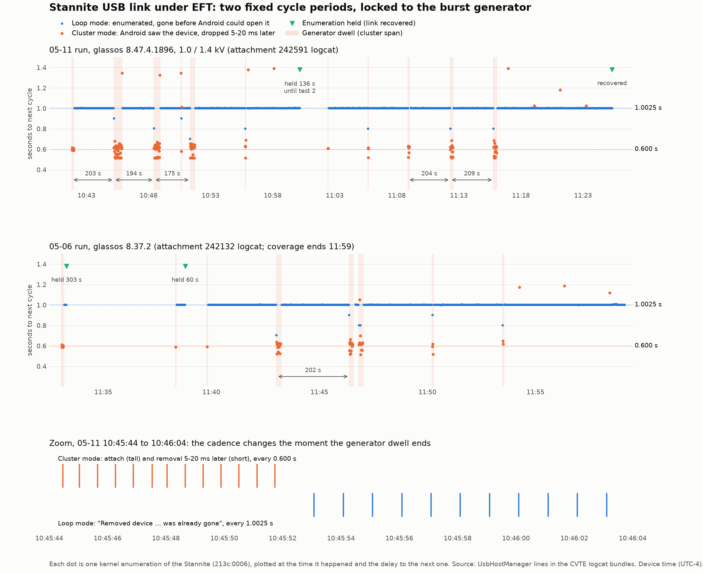

# CRY-657: Xenon ↔ Stannite USB link loss under EFT — bugreport analysis

Analysis date: 2026-10-01. Analyst input: the pre-debounce bugreport bundle `CVTE-CVTEMediatekXenon1_06-Wed-05_10.44.zip` (Allen, Jira attachment 242132, recovered from Drive folder `Xenon_EFT_USB_fail-CVTEMediatekXenon1_06-Wed-05_10.44`), plus Jira CRY-657 / BRAIN-402 / BRAIN-814 comment history, the WOLF "USB Disconnect Issue 11/1" Confluence page, and a Cesium bugreport (`bugreport-iFitG520-AP3A.240905.015.A2-2026-09-11-00-07-42`) for the topology comparison.

## Where a proper fix lives, in priority order

The logs put the failure between the tablet's USB host port and the Stannite's USB peripheral, and show that the console application cannot recover it by retrying (§2d). The fix therefore sits with three groups, in this order. Detailed per-team asks and the evidence behind them are in §4.

### 1. Brainboard firmware (iFIT), not the console

Two things the brainboard should do on its own, regardless of what Android does:

- **A USB watchdog with a real reset behind it.** The data shows the Stannite already re-attaches about once per second after a burst and gets dropped again within tens of milliseconds, over 2,000 times in a row, and only recovers on a deeper event that recurs every ~126 cycles (§2d). Whichever side is driving that cycle, the brainboard-side remedy is the same: if the device has been enumerated but has seen no valid host traffic (SET_CONFIGURATION followed by FitPro2 or audio transfers) for N seconds, do a full peripheral re-initialisation, not just a pull-up toggle: release D+ for long enough to be seen as a clean disconnect (hundreds of ms), reset the USB controller and its clocks, and only then re-attach. Most MCU USB stacks support this, and it works whether the EFT hit latched the brainboard's PHY or the host's. The firmware team's first task is to say whether FW 4.04 already has a ~1 s re-attach path and a ~2 min watchdog, because those two numbers are the loop's fingerprint (§4, Stannite items).
- **A comms-loss safety timeout.** If the console heartbeat stops for X seconds mid-workout, ramp the belt to zero. This is the fix for "software is powerless to stop the belt" (CLI-396: belt still running after the console lost the link). The stop path must never depend on a USB link surviving, and the Stannite already keeps its own controls alive through the link loss (PCA buttons kept working on 05-07), so the hardware is capable of it. This is the version a safety reviewer will want to see: a hazard-level mitigation, not a UX one.

### 2. Kernel and system level on the tablet (CVTE OS, Xenon and Cesium)

Power on the Xenon USB-C port does not follow the normal USB pattern. The Xenon is a USB PD **sink** and never sources VBUS on that port (an external device on it needs a powered hub to be discovered). When paired with a Mica brainboard the Mica is the PD source and powers the tablet over the USB-C cable. **The Stannite is not a PD source**: its BOM (Altium, 2026-10-03) has an STM32H562 MCU, AZ1117 5 V and 3.3 V regulators at 800 mA, a TAS5802 amplifier and no PD or Type-C port controller, so with a Stannite the tablet is powered from its separate 4-pin 12 V JST input, as with Quartz (Allen, 2026-10-03) and the USB-C carries data and at most an unmanaged 5 V on VBUS. The Stannite is self-powered on the data side (configuration descriptor `bmAttributes=0xC0`, 100 mA budget). Two consequences hold in every pairing: the console cannot power-cycle the brainboard, and **VBUS is not a reset lever**, because the Xenon does not drive it and the brainboard, where it drives it at all, is not something the console can switch. The only host-side levers that reset device state are on D+/D−: a USB bus reset or a port disable/enable:

- **`USBDEVFS_RESET` on the open `UsbDeviceConnection` file descriptor** is callable from glassos through JNI today, no root needed, and is a real bus reset rather than a re-open. It is the right tool for the "device enumerated but silent" case (the 05-06 12:32→12:43 hold, §2c). It cannot help during the 1 Hz loop, because no device lives long enough to be opened (§2d); the loop needs a port-level action.
- **Port disable/enable from sysfs.** On Cesium (kernel 6.1) the attribute exists: `/sys/bus/usb/devices/usb6/6-1:1.0/6-1-port3/disable` toggles the VL122 downstream port the brainboard sits on. On Xenon (kernel 5.15.94, android13-5.15 GKI) the `disable` attribute was added upstream in 6.0, so CVTE must either confirm a backport (`ls /sys/bus/usb/devices/usb1/1-0:1.0/usb1-port1/`) or provide an equivalent hook (unbind/bind of the port device, or a vendor sysfs node that forces a port reset). Either way it needs a privileged helper; Eru already runs as uid 1000, so that is natural. On Xenon the port is the SoC root port (§1); on Cesium it is a hub port, and the hub's own upstream reset is a second lever (§6).
- **No VBUS-based reset exists on this topology.** The Xenon sources no VBUS on the brainboard port, so a console-side VBUS load switch (the usual remote-reset trick for self-powered devices) is not possible, and the earlier version of this report was wrong to suggest one. The only out-of-band reset the console could ever have is a dedicated reset or enable line to the brainboard, which would need a harness and firmware change. Keep that in mind when weighing the two software paths: on Xenon they are the whole toolbox.
- **The tablet's Type-C/PD sink logic is a candidate the kernel cannot see.** The Xenon receptacle has PD sink and CC handling for the Mica case, and it is outside the Linux TCPC stack (no `tcpc`/`typec` driver touches bus 1, §1), so a standalone controller sits on that port even when a Stannite, which has no PD, is attached. If that controller, or any CC-driven orientation mux between it and the xHCI, re-evaluates CC after an EFT hit, it can break D+/D− without the kernel logging anything but the resulting disconnect. CVTE should identify the part and say whether it is in the data path (Draft B, item 3).
- **Xenon PHY tuning (CVTE).** Confirm the 2024 BRAIN-402 EFT change was applied to the PHY instance behind the Stannite USB-C receptacle, and whether the register changed affects a full-speed link (§1). On Cesium the equivalent question goes to VIA for the VL122 (§6).

### 3. glassos (Valinor), scoped as the orchestrator

The retry loop proposed in CRY-784 is still worth doing, but it recovers nothing by itself. The 05-11 log shows the 1.5 s debounce doing exactly what it should (252 arms, 248 cancels, 4 connects within 10 ms of the timer) and still waiting 8 to 9 minutes because the link never held (§2d). Scope it as: detect the dead or looping link (no surviving attach for N seconds, or N consecutive device-node create/remove pairs with no attach), trigger the reset mechanisms above in escalating order (`USBDEVFS_RESET` if a connection exists, then the port toggle through Eru), poll `UsbManager.getDeviceList()` on a backoff timer between attempts, and surface the recovery state and its failure to the user. Position it as the thing that triggers recovery and tells the user when it fails, not as the thing that recovers the link. Acceptance criteria should require an actual device-reset mechanism (ioctl or port toggle), not a longer timer.

### Things to check before committing to the software path

- **Pull `dmesg` from a failing unit while the loop is running.** One minute is enough. Each cycle starting with `usb usb1-port1: disabled by hub (EMI?)`, a port reset or `-71`/`-32` errors points at the console's host controller or PHY; each cycle being a plain `usb 1-1: USB disconnect` followed by a clean `new full-speed USB device` points at the brainboard dropping its pull-up (§2d, item 4). Note that the enumerations themselves succeed in both runs, so a storm of descriptor-read errors is not what to expect; the discriminator is what precedes each disconnect. No existing capture covers a run of cycles, and the 05-11 bundle (Jira 242591) almost certainly does not either: it was pulled at 09:51 MDT, which is 11:51 device time, 26 minutes after the loop ended, and the dmesg ring buffer holds about 10 minutes (§0).
- **Hub or not.** Checked: Xenon has no hub, the Stannite is on a SoC root port (§1). Cesium does, the brainboard is on VL122 downstream port 3 (§6), so on Cesium an EFT hit may latch the hub and only a hub port toggle or hub reset clears it, which the app layer cannot reach without the helper in item 2.
- **Transient protection and shield grounding on the brainboard and the cable.** A later run passed with a better USB-C cable, and the historic fixes were ferrites, both pointing at common-mode coupling into the pair. CRY-657 is IEC 61000-4-4 burst (EFT) on the cable; the BRAIN audio tickets are IEC 61000-4-2 air discharge (ESD), a different coupling mechanism. If the loop reproduces at the required EFT level on the cable, the root cause is a hardware compliance item and the software work is a field mitigation, not the fix.

So: yes to the retry loop, but make its acceptance criteria require an actual device reset mechanism, and open a parallel brainboard firmware ticket for the USB watchdog and the comms-loss belt stop. The firmware ticket closes the hazard; the glassos ticket closes the frozen screen.

## How the three tickets relate

| Ticket | What it is | State (2026-10-02) | What actually changed |
|---|---|---|---|
| CLI-396 / VAL-8863 | The user-facing symptom: belt kept running after cooldown and the console froze, after an 18-minute USB flap on a Stannite (functional test, no EFT). Matthew's investigation in the ticket is the source of the "active reconnect" recommendation. | Done (Retail-2026-05 / Glass-2026-06) | **No code fix is recorded against it.** It was closed on 2026-09-30 by Sean Brady Campbell with "no additional instances seen on Glass-2026-06 with its expanded Stannite testing, passing for now". The only code change in the chain is the CRY-657 1.5 s debounce, which this ticket cites as `glassos-sindarin-kotlin` PR #484 and says "does not help once the link is already gone". That PR number appears nowhere in CRY-657 itself, and CRY-657 only ever calls the debounce a test build, so whether it reached a production release is unconfirmed (see the CRY-657 row). |
| CRY-657 | The EFT test failure and the debounce change (transport layer, 1.5 s connect-on-attach). | Blocked on OS/HW input | Debounce **tested** as glassos 8.47.4.1896 on one tablet (UUID 55f358e4) on 05-11 and behaves correctly (§2d). Matthew's 05-08 comment: "this a test build, not production. We need to evaluate impact on anything else before we commit to actually implementing this." No later CRY-657 comment, fix version, or development link records a merge or release; the only claim that it shipped is the PR #484 reference in CLI-396. **Confirm the PR's merge state and release before relying on it.** Recovery delay shown to be an OS/brainboard loop, not an app issue. |
| CRY-784 | Matthew's proposal for a glassos self-initiated reconnect/reclaim loop plus a FitPro2 "connection lost" UX, keyed off the dead-link state. The software half of CLI-396's recommendation #1. | Backlog, unassigned, no comments | Not a duplicate of CLI-396: CLI-396 was the bug, CRY-784 is the capability that was supposed to fix it and was never built. It is the right place to answer with the two preferred methods below. |

Two corrections to the premises in CLI-396 and CRY-784 that matter for how CRY-784 is scoped:

- **"Re-enumerates as invalid productId 6 / UNKNOWN" did not happen.** PID 6 is the Stannite's real product ID and every enumeration carried a valid descriptor (§2b). The "not a valid product, was UNKNOWN" and "invalid productId 6" lines come from a second device-type handler in glassos that runs in parallel and always rejects the device; the Stannite handler connects a few ms later. The flap in CLI-396 was a link problem, not a descriptor problem.
- **In CLI-396 there was nothing to reclaim.** The last enumeration (device 066) detached at 11:29:15 and no attach of any kind followed for 31 minutes; Eru saw the same silence. The brainboard was off the bus, so a glassos loop polling `getDeviceList()` or re-opening a handle would have found nothing. The recovery at 12:00:09 came back as device **002**, a number the kernel only hands out after the bus is re-initialised (or after a 126-number wrap), which points at a bus or port-level reset coinciding with the "app restart", not at the restart itself. That is the same conclusion as this report: the levers that recover the link are a brainboard-side re-attach or a host-side port reset, and glassos should trigger those rather than retry on its own.

## Draft responses (for review, not posted)

### A. To the iFIT brainboard firmware team (Stannite): USB watchdog and comms-loss stop

> Context: CRY-657 (Xenon + Stannite EFT) and CLI-396 (Stannite USB flap in functional test). In both, the Stannite USB link goes into a state where the host enumerates it successfully about once per second and loses it again within tens of milliseconds, for minutes at a time (2,299 cycles in the 05-11 run), and the link only recovers on a deeper event that recurs every ~126 cycles. The cycle has two fixed periods: 0.600 s while the burst generator is applying, when the board even gets as far as being opened by Android before it drops, and 1.0025 s between applications. In CLI-396 the board was off the bus entirely for 31 minutes. We understand the Stannite already has a watchdog; we need to know what it covers so we can decide whether the fix is in firmware, in the tablet OS, or both.
>
> Questions:
>
> 1. What does the existing watchdog monitor and reset: the MCU as a whole, the USB peripheral, or application-level activity? What is its timeout, and does it release the D+ pull-up during its reset?
> 2. Does FW 4.04 have any path that re-initialises or re-attaches USB on a fixed timer (USB error handler, brown-out handler, audio codec fault handler that resets the USB stack)? We see 0.600 s and 1.0025 s re-attach periods and a deeper event every ~126 cycles (about 2 minutes). Those three numbers are the fingerprint in both EFT runs; if any of them matches a firmware timeout, the loop is on the board. Specifically: in `drivers/source/USB/IH-USB-Zephyr.c` the send task appears to do `usb_disable(); ih_task_sleep(1); usb_enable(NULL);` on a failed `usb_write()`, and the same disable/re-enable runs on a host `USB_DC_RESET` during an in-flight IN transfer. What is the unit of that sleep, what makes the first write after enumeration fail, and does the 1.5 s `RESEND_TIMEOUT` in `IH-USB-Router.c` keep queueing IN transfers while the host is not draining them? A 1 s disable/enable cycle on write failure would reproduce what we see.
> 3. The Stannite BOM has no PD or Type-C controller and the tablet sources no VBUS, so neither side can use VBUS to reset the other. Please confirm what the Stannite drives on USB-C VBUS (nothing, or 5 V from the AZ1117), how the tablet is powered in the Stannite pairing, and whether the STM32H562's USB peripheral uses VBUS sensing at all. Also: does the firmware's USB stack react to a host bus reset or a CC event by re-initialising USB?
>
> Requests:
>
> 1. A USB-link watchdog: if the device is enumerated but has seen no valid host traffic (SET_CONFIGURATION followed by FitPro2 or audio transfers) for N seconds, do a full USB peripheral re-initialisation: release D+ long enough to be seen as a clean disconnect (hundreds of ms), reset the USB controller and clocks, then re-attach. A pull-up toggle alone is not enough; the current behaviour already looks like a fast re-attach that does not clear the fault.
> 2. A comms-loss safety timeout: if the console heartbeat stops for X seconds during a workout, ramp the belt to zero. CLI-396 ran the belt for 31 minutes with no software path to stop it. The stop path must not depend on the USB link surviving. The board already keeps its own buttons working through the link loss, so this is a firmware policy change, not a hardware one.
> 3. A UART or debug trace of USB state (attach, configured, reset, watchdog fire) that we can capture during one EFT application and line up against the tablet's `UsbHostManager` log.

### B. To CVTE (Xenon now; Cesium design): kernel and OS asks

> Context: CRY-657. During and after IEC 61000-4-4 burst on the Stannite USB cable, the Xenon kernel enumerates the Stannite on root port 1 of the host-only controller (`usb 1-1`, full-speed, `xhci-mtk-p1`) once every 1.0025 s and loses it again within tens of milliseconds, for 8 to 9 minutes after the burst stops, until one enumeration holds (while the generator is actually applying, the period is 0.600 s and the device lives long enough for Android to open it). The only kernel record we have of a recovery is `usb usb1-port1: disabled by hub (EMI?), re-enabling...` followed by a clean re-enumeration. Android (glassos) cannot act during this loop because no device lives long enough to be opened. We need the following.
>
> 1. **Kernel log coverage.** The dmesg ring buffer on VKX1_20241014 holds about 10 minutes because of the per-CPU `[wdk-c]`/`[wdk-k]` watchdog lines every ~15 s, so no bugreport has ever captured the burst period. Please either rate-limit those lines or raise `log_buf_len` so a bugreport covers at least an hour, and enable pstore/ramoops so `LAST KMSG` exists.
> 2. **Port signature.** From your side, capture `dmesg` during one minute of the loop and tell us whether each cycle begins with a port error (`disabled by hub (EMI?)`, port reset, `-71`/`-32`) or with a plain `USB disconnect` followed by a new enumeration. The first means the Genio 700 port/PHY is tripping; the second means the device is dropping off. Please also check whether anything in `xhci-mtk` (port-status-change handling, the periodic-endpoint bandwidth scheduler for this device's three 1 ms endpoints, the `drop_ep_quirk` path) can re-trigger once per device-number wrap.
> 3. **PHY instance and the 2024 tuning.** Confirm which controller and `mtk-tphy` instance sits behind the Stannite USB-C receptacle (`readlink /sys/bus/usb/devices/usb1`) and whether the VKX1MP16_20240403 EFT change (Vterm 780→800 mV) was applied to it or only to the PHY behind the USB-2 JST connector. State which register was changed and whether it affects a full-speed link, since the Stannite is FS and the HS disconnect-envelope threshold does not apply to FS. Also identify the PD sink controller on this receptacle (the Xenon is powered by the brainboard over this cable) and any CC-controlled orientation mux between it and the xHCI: part number, whether it sits in the D+/D− path, whether it re-evaluates CC orientation after a CC glitch, and whether its events can be logged. It is invisible to the kernel today.
> 4. **A port-level recovery hook.** Kernel 5.15.94 (android13-5.15) predates the upstream `/sys/bus/usb/devices/.../usbN-portM/disable` attribute (added in 6.0). Please either backport it or expose an equivalent vendor node that disables and re-enables root port 1, callable by a system-uid process (Eru). Also consider doing it in-kernel: if a port sees N consecutive enumerations that die within 1 s, disable and re-enable the port once. Port power cycling does not apply here: the Xenon is the PD sink on this cable and sources no VBUS. `UsbManager.resetUsbPort()` does not cover this root port because it is not a Type-C port under the USB HAL.
> 5. **`dumpsys usb` crash.** `UsbDescriptorParser` throws `IllegalArgumentException` on the Stannite descriptor (and logs `Unknown Audio Class Interface subtype:0xa`), so the USB port-manager state is missing from every Xenon bugreport. Please fix the parser or guard the dump.
> 6. **Cesium.** The brainboard is behind the on-board VL122 hub (schematic C.G520.702B: Quartz on JST USB `CN2` = `HSD3` = `6-1.3`; Stannite/Mica on USB-C `JU1` = `HSD4` = `6-1.4`; hub upstream on SoC pair P3), not a SoC port, so items 3 and 4 move to the hub. Please expose three existing hardware levers to a system-uid process: the hub reset GPIO `HUB_RESET_IC`, and the JST USB and Type-A port power enables `USB_HOST1_CTL` / `USB_HOST2_CTL` (TMI6263BH switches); the Type-C port sources no VBUS, so for the Stannite path the hub port disable or the hub reset is the deepest host-side action. Also confirm whether production boards populate `R312/R313` (direct SoC pair P1 to the Type-A) or anything equivalent for the brainboard ports. On the hub itself: the `6-1-port3/disable` attribute exists on 6.1, but we also need to know whether the VL122 downstream port can latch disabled under burst and whether its upstream link resets, and we would like the same in-kernel port disable/re-enable policy applied to hub ports. The VL122 is on the tablet board, not in the harness, so it is powered from the tablet's rails; the tablet does not source VBUS to the brainboard, so port power cycling is no more available on Cesium than on Xenon. The direct USB2 pair at V34/V35 is the alternative routing we want to A/B against the hub path.

### C. Reply on CRY-784 (glassos active reconnect)

> Agree with the core of this ticket: a purely attach-broadcast-driven reconnect is not enough, and FitPro2 needs a "connection lost" state like FitPro1's Fatality. Three findings from the CRY-657 logs should shape the scope, and the short version is: keep the glassos logic simple, because the recovery itself has to happen below glassos.
>
> 1. The "invalid productId 6 / UNKNOWN" premise is wrong. PID 6 is the Stannite's real product ID and all 380 enumerations across both EFT runs carried a valid descriptor. Those log lines come from the parallel UNKNOWN device-type handler, which always rejects vendor 8508; the Stannite handler connects a few ms later. There is no bad-descriptor state to filter for.
> 2. In CLI-396 there was nothing to reclaim. The board detached at 11:29:15 and no attach of any kind followed for 31 minutes (Eru saw the same silence), so a loop polling `getDeviceList()` or re-opening a handle would have found no device. The recovery at 12:00:09 came back as device number 002, which the kernel only issues after the bus is re-initialised; something reset the port or bus at that moment, and that is what recovered the belt, not the app restart. In CRY-657 the opposite happens: the device re-enumerates every 1.0025 s and dies within tens of ms, and the 1.5 s debounce in 8.47.4.1896 handled it exactly right (252 arms, 248 cancels, 4 connects within 10 ms of the timer) and still waited 8 to 9 minutes because the link never held. Neither case is improved by more retries or a longer timer in glassos.
> 3. The two mechanisms that do recover the link are being requested elsewhere: a USB watchdog and comms-loss belt stop in Stannite firmware (closes the hazard), and a port disable/enable hook plus in-kernel port power-cycle in the CVTE OS (recovers the link whichever side is looping).
>
> Suggested scope for this ticket, kept small:
>
> - Detect the dead-link state on a timer, trigger-agnostic as written: no surviving attach for N seconds, or N consecutive device-node create/remove pairs with no attach, or the existing "No longer communicating" teardown.
> - On detection, escalate in order: (a) if a `UsbDeviceConnection` handle still exists, `USBDEVFS_RESET` on its fd via JNI; (b) ask Eru to toggle the brainboard's port through the OS hook from CVTE; (c) show the FitPro2 "machine connection lost, use the hardware stop button" state. Bound and back off the attempts; stop when a genuine attach broadcast arrives.
> - Log a single "USB loop detected" event with the cycle count so the condition is visible in Eru reports.
> - Do not add polling re-enumeration, extended retry counts, or product-ID heuristics; they cannot act while the kernel cannot keep the device enumerated.
> - Acceptance: verified on a Stannite by forcing the link down and confirming recovery through (a) or (b) without an app restart, plus the UX state when both fail. The belt stop is out of scope here and belongs to the firmware ticket.
>
> CLI-396 was closed by observation (no recurrence on Glass-2026-06), not by a code change, so this ticket is the only open software item for the dead-link case and is not a duplicate of it.

## 0. Coverage and what could not be analysed

| Attachment | Status |
|---|---|
| 242132 pre-debounce bundle (05-06) | Analysed in full: `dmesg.log`, `logcat.log.txt`, `com.ifit.glassos_service/log.latest.txt`, `device_properties.txt`, and the embedded Android bugreport (`bugreport-Xenon-TP1A.220624.014-2026-05-06-12-45-05`). |
| 242591 post-debounce bundle (05-11, 1.0/1.4 kV, `CVTE-CVTEMediatekXenon1_2026-05-11_09.51.10.zip`, 4.8 MB, uploaded by Keyvan 05-11 10:19 MDT) | **Analysed** from Allen's unzipped copy in Drive (folder `1nsht5nVUgssv9RaaOJHSODZzh84D7Q1s`; Jira downloads themselves are blocked by this environment's network policy). Contents: `dmesg.log`, `logcat.log`, `device_properties.txt`, `memory_info.txt`, `bugreport-Xenon-…-2026-05-11-11-51-31.zip`. **`dmesg.log` covers 11:45:15 → 11:51:27 device time only** and contains no host-side USB line at all (its only USB lines are the `mtu3 112b1000.usb` gadget/ADB lines from the cable used to pull it). The bundle was pulled at 11:51 device time, 26 minutes after the loop ended at 11:25:20 (the CVTE tool names the zip with the lab PC clock, MDT; the device clock is UTC−4), so the ~6 minute kernel ring buffer had long rolled past the loop. **`logcat.log` covers 10:39:37 → 11:51:27** and so adds the first six minutes of the run (10:39 → 10:45:53) that the Eru `adbLogs.txt` in 242592 does not have; results in §2d. The Slack zip Matthew Thomas posted on 05-12 (`2026-05-12@15.51.23.zip`) is from a different tablet (UUID 33295a3d…, glassos 8.46.5) and is unrelated. |
| 242592 Eru "report an issue" log (Tayte, 05-11) | **Analysed in full** (uploaded by Allen on 2026-10-02). Device UUID 55f358e4…, glassos_service **8.47.4.1896** (debounce build), Stannite FW 4.04. Contains `com.ifit.glassos_service/log.latest.txt` (10:12 → 12:33 on 05-11), `adbLogs.txt` (a logcat covering 05-11 10:45 → 12:33 with `UsbHostManager` lines; no kernel buffer), and the Eru, Rivendell, Arda, Mithlond, Gandalf logs. Results in §2d. |
| 242134 Valinor_Forensic_Analysis.pdf | Not retrievable; the Google Doc source of it was read. Its "one-hour kernel/framework clock offset" claim is wrong (see §1 clock note) and its Zylux conclusions are unrelated, as the Valinor team already said. |
| BRAIN-824 / BRAIN-814 Eru logs | Not retrievable from Jira; not in Drive. Classified from ticket text and from the Cesium bugreport that is in Drive. |

Consequence: the "~6 min after the burst stops" recovery that Keyvan reported (05-11 run) is now covered end to end at the Android level (242591 `logcat.log` from 10:39:37, 242592 `adbLogs.txt` and the glassos log to 12:33) but still not at the kernel level. Attachment 242591 confirmed the expectation: it was pulled 26 minutes after the loop ended and its `dmesg.log` holds only 11:45 → 11:51, with no `xhci`/`usb 1-1` line in it. A kernel record of the loop therefore needs a new capture taken while the loop is running (§9, item 1). Clock cross-check: the Eru feedback that produced 242592 says "noise burst ran around 8:45 ish" (lab time, MDT), which is 10:45 device time, the start of the second burst application in the 242591 logcat (the first was 10:41:49).

### Log-coverage facts that matter for reading the evidence

- `dmesg.log` is the kernel ring buffer and only covers **12:33:56 → 12:45:02** (the last 11 minutes before the bugreport). The entire burst period (11:33 → 12:29) is outside it. `/proc/last_kmsg` does not exist on this build.
- `logcat.log.txt` has three buffers: *system* 09:49:13 → 11:46:37, *crash* 11:46:38 → 12:36:43, *main* 12:36:43 → 12:45:01. `UsbHostManager` lines therefore exist only for 11:33 → 11:59.
- `com.ifit.glassos_service/log.latest.txt` is the only continuous record of the whole test and is used as the primary USB event timeline. It is a concatenation of rotated files: lines 1–3981 are stamped with the pre-NTP clock (09:49–09:53, offset −1 h 39 m 54 s from real time; the "09:53 burst" is the 11:33 burst), lines 3982–4503 are a flushed "delayed log" block from an older boot (21:27), and the real-clock content starts at line 5593 (11:30:54). Only the 11:xx/12:xx block is used below.
- Clock alignment: kernel bracket timestamps match logcat and glassos (12:43:43 kernel re-enable ↔ 12:43:44.587 `UsbAlsaManager` removal ↔ 12:43:44.600 glassos detach; dmesg ends 12:45:02, bugreport taken 12:45:05). No inter-log offset needs to be applied. Absolute wall time is suspect (the device's zone looks like UTC−4), so correlate with the lab's test record by relative offsets.
- Device: `CVTEMediatekXenon1`, OS `VKX1_20241014` (Android 13, MT8390 / Genio 700; the kernel platform string is `mt8188`), glassos_service **8.37.2** (no debounce), SELinux permissive (`permissive=1` on every avc line).

## 1. Bus topology of the Stannite port (answers H2)

```
Genio 700 (MT8390)
 ├─ 11200000.xhci1 / 11201000.usb1   host-only xHCI  ── bus 1 (USB2 root hub) ── root port 1 ── [USB-C receptacle] ── Stannite  (usb 1-1, full-speed)
 │                                                     └─ bus 2 (USB3 root hub, unused)
 ├─ 112a0000.xhci2 / 112a1000.usb2   host-only xHCI  ── bus 3 / bus 4 (nothing enumerated)
 └─ 112b0000.xhci  / 112b1000.usb    mtu3 dual-role (OTG) + TCPC MT6375 / rt_pd_manager ── bus 5 / bus 6 ── ADB / charging port
```

Evidence:

```
[Wed May  6 12:43:43 2026] usb usb1-port1: disabled by hub (EMI?), re-enabling...
[Wed May  6 12:43:43 2026] usb 1-1: USB disconnect, device number 51
[Wed May  6 12:43:44 2026] usb 1-1: new full-speed USB device number 52 using xhci-mtk-p1
[Wed May  6 12:43:44 2026] usb 1-1: New USB device found, idVendor=213c, idProduct=0006, bcdDevice= 4.04
[Wed May  6 12:43:44 2026] usb 1-1: New USB device strings: Mfr=1, Product=2, SerialNumber=0
[Wed May  6 12:43:44 2026] usb 1-1: Product: LargeX-Stannite
[Wed May  6 12:43:44 2026] usb 1-1: Manufacturer: IFIT
```

- Path `1-1` = root port 1 of bus 1. A hub would give `1-1.x` and the hub itself would enumerate first; neither appears anywhere in dmesg, logcat (`/dev/bus/usb/001/NNN` only, always the Stannite) or glassos. **There is no hub on the Stannite path on Xenon.** Hub checklist applied to this bugreport: no hub-class device (`mClass=9`) ever enumerated; no VIA vendor ID (0x2109) anywhere in dmesg, logcat or the bugreport; all 1,820 device-node references across logcat and glassos are on bus 001 with undotted paths; and the one port event captured is logged against the **root hub** (`usb usb1-port1: disabled by hub (EMI?)`), not against a `hub 1-1:1.0: port N` downstream port. So on Xenon the SoC PHY is the one tripping. (Note the Cesium design is different, see §6.)
- SoC identification: `ro.hardware=mt8390`, with `ro.board.platform=mt8188` and `init.mt8188.usb.rc` as the kernel platform family strings, i.e. the **MT8390 (Genio 700)** that the 2024 BRAIN-402 PHY fix was made on.
- Bus 1 is served by `xhci-mtk-p1`, a host-only `xhci_mtk_hcd` instance. The dual-role controller `112b1000.usb` is a different block: at 12:43:37 it switched host→device→none (`ssusb_mode_sw_work_v2`, buses 5 and 6 deregistered) when a cable was plugged for ADB, and the Stannite on bus 1 was unaffected. By elimination bus 1 belongs to `11200000.xhci1` (CVTE should confirm with `readlink /sys/bus/usb/devices/usb1`).
- Type-C: the only TCPC/PD drivers loaded (`tcpc_mt6375`, `tcpc_class`, `rt_pd_manager`, `tcpci_late_sync`, `extcon_mtk_usb`) belong to the dual-role port. No `tcpc`/`typec`/`pd` message touches bus 1. Whatever sits behind the Stannite USB-C receptacle is not a Type-C port controller the kernel knows about.
- The Stannite is a **full-speed** composite device: config "FS Configuration", 100 mA; IF0 vendor-specific (class 255) with interrupt endpoints 0x83 IN / 0x03 OUT, 64 B (FitPro2); IF1 audio control; IF2 audio streaming (isochronous 0x01 OUT 196 B + feedback 0x82). Power: the Xenon sources no VBUS on this port and the Stannite has no PD controller (BOM), so the USB-C cable carries data and at most an unmanaged 5 V; the tablet's power in this pairing comes from the separate 4-pin 12 V JST input. iFIT has no rights to the Xenon schematic, so the Xenon port map rests on the kernel evidence in this section rather than on a drawing; the Mica also uses the USB-C receptacle (chosen over JST for EMI margin despite the cost), so it shares this root port. A full-speed USB 2.0 link through a Type-C receptacle needs no orientation mux if the board ties A6/A7 to B6/B7, so Allen's "switch" is either a transparent analog switch, a CC-driven orientation mux, or does not exist on the data pair; CVTE must say which, because a CC-driven mux puts the PD controller in the data path. Either way the **Genio 700 U2 PHY instance behind xhci1 owns disconnect detection, squelch and bus-error handling for this port**. The 2024 BRAIN-402 tuning (VKX1MP16_20240403, Vterm 780→800 mV, "Modify USB driver parameters to optimize EFT disconnection issues") can reach this port *if* CVTE applied it to that PHY instance and not only to the instance behind the USB-2 JST connector. One caveat to raise with CVTE: the HS disconnect-envelope threshold only matters on high-speed links; Stannite runs full-speed, so ask which register was changed and whether it also affects FS squelch / disconnect debounce.
- Bonus finding: `dumpsys usb` crashes on this device (`UsbDescriptorParser … ByteStream IllegalArgumentException` while dumping the Stannite connection record; also `UsbACInterface: Unknown Audio Class Interface subtype:0xa`). The USB port-manager section is therefore missing from every Xenon bugreport. This is an AOSP/CVTE bug worth a separate ticket because it hides exactly the information this investigation needed.

## 2. Timeline, pre-debounce run (05-06, glassos 8.37.2)

All times are device time; 11:33 is the first disconnect of a brainboard that had been stable since boot (~11:29) as device number 2.

### 2a. Burst windows seen by Android (glassos SDUSB broadcasts, cross-checked against `UsbHostManager` where logcat covers)

| Window | Attach/detach cycles | Notes |
|---|---|---|
| 11:33:04 → 11:33:18 | 10 | First burst; glassos reconnects at 11:33:18, FitPro2 initialised 11:33:20 |
| 11:38:20 → 11:38:22 | 3 | followed by 1 Hz failed enumerations until 11:38:47; stable at 11:38:48 |
| 11:39:47 → 11:39:50 | 3 | then failed enumerations 11:39:50 → 11:43:01 (≈190 s) |
| 11:43:01 → 11:43:13 | 20 | then failed enumerations → 11:46:23 (≈190 s) |
| 11:46:23 → 11:47:01 | 33 | then failed enumerations → 11:50:14 (≈190 s) |
| 11:50:14 → 11:50:17 | 4 | then failed enumerations → 11:53:29 (≈190 s) |
| 11:53:29 → 11:53:32 | 3 | then failed enumerations → 11:54:15 |
| 11:54:15, 11:56:20, 11:58:26, 12:00:32, 12:02:38 | 1 each | isolated single flaps, **period 125.7 s** |
| 12:06:33 → 12:06:35 | 3 | then failed enumerations → 12:09:45 (≈190 s) |
| 12:09:45 → 12:09:48 | 3 | → 12:12:58 (≈190 s) |
| 12:12:58 → 12:13:03 | 6 | → 12:16:14 (≈190 s) |
| 12:16:14 → 12:16:46 | 50 | → 12:19:57 (≈190 s) |
| 12:19:57 → 12:20:48 | 45 | |
| 12:22:53, 12:24:59, 12:27:05, 12:29:10 | 1 each | isolated single flaps, **period 125.7 s** |
| 12:43:44 | 1 | the "disabled by hub (EMI?)" re-enable, see 2c |

Totals over the test: **191 successful enumerations** (190 detaches) seen by Android; **1,139 failed kernel enumeration attempts** logged by `UsbHostManager` as `Removed device at /dev/bus/usb/001/NNN was already gone` between 11:33 and 11:59 alone, at exactly one per second with the device number advancing by one each time (e.g. 11:40:00 → 059, 11:40:01 → 060 …). Device-number wrap analysis of the glassos log shows the same 1 Hz loop continued in every ≈190 s window through 12:19:57, so the whole test produced roughly 1,800 failed enumerations. The "396 OS-level detaches" counted by the Valinor team is the 11:33–11:59 subset of successful-then-dropped enumerations plus a part of the failed ones.

Interpretation of the two patterns (revised after the 05-11 analysis in §2d):

- The **windows of 1 Hz "already gone" events** are not failed enumerations. A `/dev/bus/usb/001/NNN` node only exists after usbcore has completed enumeration (reset, SET_ADDRESS, device and configuration descriptors, strings), so each event is a *complete, successful* kernel enumeration after which the device disappeared within a few tens of milliseconds, before `UsbHostManager` could open the node. The cycle period is **1.002–1.003 s** (497 + 489 of 1,063 intervals in 11:40–11:58 are exactly 1002 or 1003 ms), far too regular for random burst hits. The link is therefore being torn down and rebuilt by something deterministic for as long as the loop lasts; the EFT burst is what *starts* it.
- The **short attach/detach clusters** are enumerations that survived long enough for Android to see them. They are a second, equally regular mode of the same loop: inside a cluster the cycle period is **0.600 s** (attach → removal 5–20 ms later → next attach ~590 ms after that), against **1.0025 s** in the "already gone" mode. The very first cluster of each day (11:33:04 here, 10:41:50 on 05-11) is the exception: there the device lived 150–165 ms after each attach. Cluster starts are spaced **193–209 s apart** in both runs (05-06: 193, 202, 200, 195 s; 05-11: 203, 194, 194, 194, 204, 209 s) and last 1–40 s, which is the shape of a burst generator applying a dwell every ~3¼ minutes. So the 0.6 s mode is the link's behaviour **while the burst is applied** and the 1.0 s mode is what it does **between applications**, until the loop ends (§2d, item 5). The test team should confirm the application schedule from the generator log.
- The **≈125.5 s isolated single flaps** are not a timer. Each one is the enumeration that occurs **exactly every 126th cycle of the 1 Hz loop**, and it always carries the **same USB device number** within a series (045 at 11:54:15, 11:56:20, 11:58:26, 12:00:32, 12:02:38; 051 at 12:22:53, 12:24:59, 12:27:05, 12:29:10), i.e. once per wrap of the 126-value device-number space. Every recovery from a **long** loop (more than one wrap) in both runs happened on one of these cycles (12:02:38 and 12:29:10 here; 11:00:11 and 11:25:20 on 05-11). The two short loops on 05-06 (7 cycles ending 11:33:18 at dev 019, 25 cycles ending 11:38:47 at dev 047) ended on an ordinary cycle, so the wrap event is not the only exit, but at 1.0/1.4 kV on 05-11 it was. Whatever lets that one cycle live longer is also what ends the loop. This is the fingerprint to match against the host xHCI/PHY and against Stannite firmware (§2d).

### 2b. Whether the brainboard enumerated with valid descriptors (answers H4)

Every one of the 191 successful enumerations reported `vidpid 213c:0006 mfg/product/ver/serial IFIT/LargeX-Stannite/4.04/null`, class 239/2/1, identical interface and endpoint set. **`productId 6` is the Stannite's real PID (0x0006, "LargeX-Stannite")**, not a corrupted descriptor; `mVendorId=8508` is 0x213C (ICON). This also settles two documentation points: the Stannite control interface is **vendor-class 255 with interrupt endpoints**, the same shape as the Quartz reference descriptor (`213c:0003 "iFIT-LargeX" v3.03`, see §6), not a CDC/USB-serial interface; and glassos 8.37.2's `FIT_PRO_2_STANNITE` handler **does** accept PID 6 (28 of 28 permission grants in this log were handled by it and connected). The "invalid productId 6 / UNKNOWN" wording from VAL-8863 almost certainly refers to the same parallel `UNKNOWN` handler described next. The "UNKNOWN" in glassos logs is the label of a second device-type handler inside glassos that runs in parallel with the `FIT_PRO_2_STANNITE` handler on every permission grant and always logs `Working with device : UNKNOWN … invalid vendorId 8508 … Giving up on claiming USB connection`; the Stannite handler succeeds 1–5 ms later. Those lines (and `Device detached is not from our vendor ZYLUX`) are noise, not failures. The CLI-396 observation "re-enumerated as productId 6 / UNKNOWN" is therefore normal behaviour.

### 2c. Recovery after each window and after the test (answers H3)

| Window end (last failed/short attach) | Stable attach | glassos connected | FitPro2 initialised | Kernel→app delay |
|---|---|---|---|---|
| 11:33:18 | 11:33:18.04 (dev 019) | 11:33:18.08 | 11:33:20.9 | 2.9 s |
| 11:38:47 | 11:38:47.96 (dev 047) | 11:38:48.01 | 11:38:51.4 | 3.4 s |
| 12:02:38 | 12:02:38.57 (dev 045) | 12:02:38.60 | 12:02:46.3 | 7.7 s |
| 12:29:10 | 12:29:10.62 (dev 051) | 12:29:10.66 | 12:29:12.9 | 2.3 s |
| 12:43:43 | 12:43:45.02 (dev 052) | 12:43:45.05 | 12:43:48.2 | 3.1 s |

- Whenever the bus went quiet, usbcore enumerated the Stannite within ~1 s and glassos (even without debounce) was talking within 3–8 s. **There is no minutes-long backoff in Linux usbcore or in glassos** in this run. (One exception not caused by EFT: `com.ifit.eru` force-stopped and restarted glassos_service at 11:58:31 — an app update — so nothing could connect between 11:58:26 and 12:02:38.)
- The last test flap was 12:29:10; the workout then ran normally and ended at 12:32:14 (PAUSED → RESULTS → IDLE, all ACKed). From 12:32:14 to 12:43:44 glassos logged no FitPro2 traffic at all (console idle; FitPro2 heartbeats on this build are event-driven, and the 1/min "Console Basic Info" poll stops with the workout), so **liveness during that 11.5-minute gap is undetermined**.
- At 12:43:43 the kernel found root port 1 **disabled while still showing a connection** (`usb usb1-port1: disabled by hub (EMI?), re-enabling...`), tore down device 51 and re-enumerated device 52, and audio and FitPro2 came back together within 2 s. This is the only kernel USB event in the 11-minute dmesg window; there is nothing in the gap before it. Six seconds earlier (12:43:37) somebody plugged a cable into the OTG port (ADB) to pull the bugreport. If that cable was plugged because the console looked dead, then the port had been sitting in the disabled state and was only serviced when the system was kicked.

The 05-11 Eru log (§2d) shows that during Keyvan's "~6 minutes after the burst stops" the link was **not quiet**: the 1 Hz enumerate-and-drop loop ran continuously until the moment of recovery. The 12:32→12:43 hold in this run is the one case where Android logs do not cover the gap, so it is left as "undetermined, probably the same loop" (the 12:43:43 kernel line is consistent with the loop's final cycle: port error, re-enumerate, hold).

### 2d. Post-debounce run (05-11, glassos 8.47.4.1896, 1.0 and 1.4 kV) — from attachments 242591 (`logcat.log`, 10:39:37 → 11:51:27) and 242592 (Eru bundle)

Device time; glassos and `adbLogs.txt` agree to the millisecond. Console booted ~10:39 (FitPro2 initialised 10:39:01), Stannite stable as device 002 until the first burst.

| Phase | Time | What the logs show |
|---|---|---|
| Test 1 start | 10:41:49.584 | device 002 (stable since boot) detached; 16 attach/detach cycles in 9.0 s at a 0.600 s period, each attach removed 150–165 ms later; glassos debounce armed and cancelled on each |
| First loop | 10:42:01 → 10:45:11 | 191 "already gone" cycles at 1.002 s (dev 019 → 083), straight out of the first cluster; this window is new from 242591 |
| Burst clusters | 10:45:12–10:45:52 (66), 10:48:26–10:48:55 (48), 10:50:36–10:50:39 (3), 10:51:21–10:51:43 (37), 10:55:47–10:55:50 (5), 10:56:01 (1), 10:58:06 (1) | each cluster = enumerations that Android saw; period 0.600 s inside a cluster, attach → removal 5–20 ms (median 7–8 ms) |
| Between and after clusters | 10:45 → 11:00:11 **continuously** | `UsbHostManager` "already gone" at **60 per minute every minute** (10:46, 10:47, 10:49, 10:52, 10:53, 10:54, 10:57, 10:59 all = 60); 1 Hz loop never pauses |
| Survivors | 10:56:01 (dev 033, 385 ms), 10:58:06 (dev 033, 383 ms), 11:00:11 (dev 033, **held**) | 124 "already gone" between each; same device number each time |
| **Recovery 1** | 11:00:11.011 attach → 11:00:12.513 debounce elapsed → 11:00:12.523 connected → 11:00:14.091 FitPro2 initialised | glassos connected **1.5 s + 10 ms** after the first attach that survived; Matthew's "178 cycles" |
| Test 2 start | 11:02:26.774 | device 033 detached after 136 s of stable operation |
| Burst clusters | 11:05:40 (4), 11:08:54–11:09:05 (11), 11:12:18–11:12:32 (23), 11:15:47–11:16:04 (28), 11:16:58 (1), 11:19:04 (1), 11:21:09 (1), 11:23:15 (1) | |
| Between and after clusters | 11:02 → 11:25:20 **continuously** | "already gone" 59–60 per minute every minute (11:17, 11:18, 11:20, 11:22, 11:24 all ≈60) |
| Survivors | 11:16:58 (dev 039, 385 ms), 11:19:04 (039, 20 ms), 11:21:09 (039, 174 ms), 11:23:15 (039, 17 ms), 11:25:20 (039, **held**) | 125 "already gone" between each; period 125.3–125.5 s |
| **Recovery 2** | 11:25:20.461 attach → 11:25:21.969 connected → 11:25:23.555 FitPro2 initialised | Matthew's "74 cycles"; glassos again connected 1.5 s after the first surviving attach |
| Post-test | 11:44:36 glassos restarted (app version log) and reconnected to 039 at 11:44:36.973 | unrelated to EFT |

Totals for 05-11 (242591 logcat, 10:39 → 11:51, cross-checked against 242592 `adbLogs.txt` from 10:45:53): **252 attaches** seen by Android (251 dropped, 1 held at 11:25:20; glassos armed its debounce 252 times and cancelled 248, the four connects being 11:00:12, 11:25:21 and two restarts), **2,299 "already gone" cycles**, every one of the 252 attaches with the identical valid Stannite descriptor (`213c:0006 LargeX-Stannite 4.04`), `UsbAlsaManager` audio removal on every detach (audio tracks the link exactly), no `AudioPolicyManager` strategy loop.

What this establishes:

1. **The debounce build behaves correctly.** It armed on all 252 attaches, cancelled on the 248 that died within 1.5 s, and connected within 10 ms of the timer on the 4 that lived. There is nothing for glassos to do differently: no attach survives 1.5 s until the loop ends, and when it ends the first surviving attach is used.
2. **The "~6 minutes after the test finished" is an active host↔device loop, not a dead link and not a backoff.** Between the last burst cluster and recovery (10:51:44 → 11:00:11 = 8.5 min; 11:16:04 → 11:25:20 = 9.3 min, of which Keyvan judged the last ~6 min to be post-test), the kernel enumerated the Stannite successfully once every **1.0025 s** and lost it again within tens of milliseconds, 500+ times in a row. Linux usbcore has no such timer; a free-running 1.0025 s cycle is a device boot/re-attach time or a host port error/reset cycle.
3. **Every exit from a long loop was on the once-per-126-cycles event**, which always lands on the same device number (033 in the first series, 039 in the second; 045 and 051 on 05-06). The 1 Hz loop and the 126-cycle event are the same mechanism viewed twice. On 05-06 two short loops (7 and 25 cycles) ended on an ordinary cycle, so an early exit is possible; at 1.0/1.4 kV on 05-11 none happened.
4. **Which side is looping cannot be decided from Android logs.** Two candidates, with the signature each would leave in the missing 05-11 `dmesg`:
    - **Host port / PHY error cycle (CVTE).** Each cycle would log `usb usb1-port1: disabled by hub (EMI?), re-enabling...` or a port reset/`-71` error followed by `usb 1-1: USB disconnect` and `new full-speed USB device`. The one kernel recovery captured (05-06 12:43:43) has exactly this shape, so this is currently the better-supported candidate. The 126-cycle event would then be something in the host that releases the port once per device-number wrap.
    - **Stannite USB re-attach loop (brainboard FW).** Each cycle would log a plain `usb 1-1: USB disconnect, device number N` with no port error before it (the device dropped its pull-up), then `new full-speed USB device number N+1`. The 126-cycle event would then be a deeper reset in the Stannite (watchdog or MCU reboot) that eventually clears the fault. The fact that the brainboard answers every enumeration with a perfect descriptor and then leaves within ~50 ms fits a firmware that resets its USB stack right after configuration; the fact that the cycle is 1.0025 s and ends after a fixed count of cycles fits a watchdog. Ask the Stannite team whether FW 4.04 has a ~1 s USB re-enumeration path and a ~2 min watchdog/reboot.
   A USB analyzer or a scope on D+/VBUS at the Stannite connector during one minute of the loop would settle it without any log.
    - **A concrete device-side candidate exists in the firmware source.** In #fw_sw_collab on 2026-07-17 (thread on a Mica brainboard rebooting during fp2_utils testing) Matthew Thomas asked Daniel Beckett whether the firmware has a watchdog that reboots it after ~6 s without app comms; Daniel: "It definitely shouldn't. As far as I'm aware." Matthew then posted an AI-generated reading of the firmware (his words: "Claude, so I have low confidence") that names two paths: the USB router re-sends the last response every 1.5 s (`utilities/source/IH-USB-Router.c:38`, `RESEND_TIMEOUT 1500`), and in the send task (`drivers/source/USB/IH-USB-Zephyr.c:299`) a failed `usb_write()` triggers `usb_disable(); ih_task_sleep(1); usb_enable(NULL);`, i.e. a deliberate re-enumeration, with the same disable/re-enable recovery on a host `USB_DC_RESET` during an in-flight IN transfer (`usbz.c:453-465`, `IH-USB-Stack-Enabler-Zephyr.c`). If `ih_task_sleep(1)` is one second, that code path *is* a 1 s detach-and-re-attach loop: the board enumerates, the first queued IN write fails (nothing is draining the endpoint yet, or the transfer slots are still full from the resend backlog), the board drops D+ for a second and comes back. That would reproduce the 1.0025 s mode exactly and would also explain why Android can open the device during the 0.6 s mode but not between dwells. It has not been verified against the source; it is the first thing the firmware team should check (Draft A, question 2).

5. **Two cycle modes, locked to the generator.** Across both days the event stream has exactly two regular periods: **0.600 s** while Android can see the device (attach, removal 5–20 ms later, next attach) and **1.0025 s** when it cannot ("already gone"). The 0.6 s clusters start every 193–209 s and last 1–40 s; the 1.0 s runs fill the gaps between them (e.g. 190, 188, 191, 191 cycles on 05-06; 191, 190, 189, 191, 193 on 05-11). That is a burst generator applying a dwell roughly every 3¼ minutes, with the link cycling at 0.6 s during the dwell and at 1.0 s between dwells. Two consequences: (a) the loop is the link's **steady state after a burst**, not a tail of each application, so the two runs are the same phenomenon (the 05-06 run also ran the loop for 9 minutes after its last cluster, 11:53:29 → 12:02:38, and again 12:20:48 → 12:29:10); (b) a 0.6 s period under active burst versus 1.0 s without it means the mechanism driving the cycle is **sensitive to the burst but not caused by each pulse**, which favours a port- or device-side error handler with its own timing over random pulse hits. The test team should confirm application start times and dwell lengths from the generator log so the clusters can be aligned exactly. Figure: `CRY-657_cycle_modes.png` (generated by `CRY-657_cycle_modes.py` from the two logcats) plots every cycle against the delay to the next one for both runs, plus a 20 s zoom across one dwell end.



Why the two runs looked different to the observers: on 05-06 the generator was applied again before the first wrap in several windows and two early loops ended on their own; on 05-11 (1.0 and 1.4 kV) no loop ended early, so every recovery waited for a wrap-survivor cycle, 8.5 and 9.3 minutes after the last cluster. Nothing in the tablet software changed how it recovers.

### 2e. Audio behaviour in this run

Every detach was accompanied by `UsbAlsaManager: USB Audio Device Removed: … USB-Audio - LargeX-Stannite` and every attach by the ALSA card re-add and `AudioFlinger openOutput … AUDIO_DEVICE_OUT_USB_HEADSET`. `AudioPolicyManagerCustomImpl setOutputDevices` lines are ordinary route switches (device 0x4000000 ↔ speaker); there is no `no device found for strategy` retry loop. Audio loss in CRY-657 is purely **USB-link class**: audio and FitPro2 share the same enumeration, so they die and recover at the same instant. Nothing software can do while the kernel cannot keep the device enumerated.

## 3. Verdicts on the hypotheses

| | Verdict | Evidence |
|---|---|---|
| H1 Host-side false disconnect / port error on the Genio side | **Supported as the better of two candidates, not proven** | The single kernel-level recovery captured (05-06 12:43:43) is a root-port "disabled by hub (EMI?)" (port error with device still present), which is the host-side signature; audio (kernel UAC, no Valinor involvement) and FitPro2 die and recover at the same ms; descriptors always valid; phone and laptop on the same fixture pass. Against it: the loop's 1.0025 s period and fixed cycle count look more like a device watchdog than anything in xHCI/usbcore. Refinement either way: the link is **full-speed**, so the HS disconnect-envelope (Vterm) parameter is not obviously the relevant knob; the fix is error tolerance and port recovery on whichever side is looping, not app logic. |
| H2 Topology: hub vs mux decides whether PHY tuning can reach it | **Xenon: refuted for "hub", direct root port confirmed. Cesium: hub confirmed (see §6), so H2 holds there** | Xenon: `usb 1-1` on `xhci-mtk-p1`, no hub device ever enumerated, port event logged against the root hub, no Type-C/TCPC on that path. Disconnect detection is owned by the Genio 700 U2 PHY behind xhci1, so PHY tuning *can* reach it; the open question is whether the 2024 tuning was applied to that PHY instance (CVTE to confirm) and whether the changed register affects a full-speed link. Cesium: brainboard at `6-1.3` behind a hub at `6-1` (VL122 per the block diagram); the hub's downstream PHY owns disconnect detection and SoC tuning cannot reach it. |
| H3 The ~6 min hold is not Linux usbcore | **Supported, and the hold is now characterised** | It is not a backoff and not silence: the kernel enumerated the Stannite successfully once every 1.0025 s and lost it within tens of ms, 2,299 times on 05-11, until a once-per-126-cycles event let one enumeration hold (§2d). glassos connected 1.5 s after that attach both times. Root cause is on the host port/PHY or in Stannite firmware; the Android logs cannot say which (discriminators in §2d, item 4). |
| H4 Device-side corruption | **Refuted for descriptor corruption; a device-side reset loop is back on the table** | 380/380 enumerations across both runs carried the identical valid descriptor (PID 0x0006 "LargeX-Stannite" 4.04), so the Stannite MCU never answered badly. But a brainboard that enumerates perfectly and drops its pull-up ~50 ms later, every 1.0025 s, with a deeper reset every ~126 s, is one of the two consistent explanations for the loop. Needs the dmesg signature or a bus capture. |

## 4. Recommended owner for the recovery delay and the specific asks

**Owner: CVTE / OS (kernel + PHY) and the Stannite firmware team jointly, until one kernel log or bus capture of the loop picks the side.** The decisive measurement is cheap: one minute of `dmesg` (or a USB analyzer / scope on D+ and VBUS at the Stannite connector) while the 1 Hz loop is running after a burst. If each cycle begins with `usb usb1-port1: disabled by hub (EMI?)` or a port-reset error, it is CVTE's; if each cycle is a plain `USB disconnect` with the device dropping its pull-up, it is Stannite firmware's. Until then, both threads run in parallel.

Specific requests for the Stannite firmware team:

1. Does FW 4.04 have any path that re-enumerates USB about once per second (USB peripheral reset on error, brown-out handler, audio codec fault handler that resets the USB stack), and a watchdog or MCU reboot with a period near 2 minutes (126 cycles × 1.0025 s)? Those two numbers are the fingerprint in both runs.
2. Add a UART/debug trace of USB state (attach, configured, reset, watchdog) and capture it during one EFT application; correlate with the tablet's `UsbHostManager` log.
3. Confirm whether the brainboard's USB pull-up / PHY is held through its own reset, or released (a released pull-up is what the host sees as a disconnect).

Specific requests for CVTE:

1. Confirm the controller/PHY instance behind the Stannite USB-C receptacle (`readlink /sys/bus/usb/devices/usb1`, which `mtk-tphy` instance it uses) and confirm whether the VKX1MP16_20240403 EFT change (Vterm/discth) was applied to that instance. If it was only applied to the JST port's PHY, apply it here too. State which register changed and whether it affects full-speed links (Stannite is FS).
2. Explain the 1.0025 s enumerate-and-drop cycle from the host side: capture `dmesg` during the loop and report whether each cycle starts with a port error (`disabled by hub (EMI?)`, port reset, `-71`/`-32`), and whether anything in `xhci-mtk` (port-status-change handling, the MTK bandwidth scheduler for this device's three 1 ms periodic endpoints, the `drop_ep_quirk` path seen in dmesg) can re-trigger once per device-number wrap. Add `dev_info` logging of port status on every hub event for this port in the next engineering build.
3. Provide an OS-side recovery path for a looping or present-but-dead link: either kernel-side (disable and re-enable `usb1-port1` after N consecutive enumerations that die within 1 s) or an exposed hook (`/sys/bus/usb/devices/usb1/1-0:1.0/usb1-port1/disable` toggle) that Eru (uid 1000, SELinux permissive on this build) can call when glassos or Eru detects the loop (N device-node create/remove pairs with no surviving attach). Android's `UsbManager.resetUsbPort()` only covers Type-C ports managed by the USB HAL and does not apply to this root port. Port power cycling is not available: the Xenon sources no VBUS on this port, so a port disable (SE0 on D+/D−) is the deepest reset the host can deliver, and it only helps if the brainboard's USB peripheral is healthy enough to re-attach.
4. Fix the `dumpsys usb` crash on Stannite descriptors (`UsbDescriptorParser` IllegalArgumentException; "Unknown Audio Class Interface subtype:0xa") so port-manager state appears in bugreports.

Hardware (Keyvan/Alan): the later pass "with a better USB-C cable" (Allen's 06-08 note) and the historic ferrite fixes point to shield/common-mode coupling into the pair; worth documenting cable shield termination at both ends and whether the receptacle shell is bonded to chassis.

Brainboard FW: no action indicated by these logs, but please confirm or deny a ~126 s periodic USB reset/re-attach in Stannite FW 4.04 under EFT.

**Cesium-specific (brainboard behind the VL122 hub, §6).** Because the hub's downstream PHY, not the MT8371, owns disconnect detection on the brainboard link, the Xenon-style PHY request does not apply. Instead:

- (a) Run a direct-vs-hub A/B EFT test on Cesium with the same brainboard: harness on the VL122 downstream port (current build) versus the direct USB2 pair at V34/V35 ("USB2 Port 2" on the schematic), if that connector can be populated on a test board. Same generator program, same cable, capture `dmesg` for both.
- (b) Open a VIA/CVTE inquiry on VL122 downstream-port behaviour under IEC 61000-4-4: disconnect-detection threshold and debounce on downstream ports, whether downstream port errors can latch the port disabled, and whether the hub's own upstream link resets under burst (a hub reset takes every downstream device with it and would by itself explain a long recovery).
- (c) Assess on each board whether the brainboard harness can be moved to a SoC root port (Cesium: the schematic's direct pair `USB_DM_P1/USB_DP_P1`, currently unpopulated `R312/R313` toward the Type-A; Xenon: already a root port) so that disconnect handling is in CVTE's PHY tuning domain rather than the hub vendor's.
- (d) For the Quartz/JST path only, the tablet can cycle VBUS through `USB_HOST1_CTL`; whether a Quartz re-initialises its USB peripheral on VBUS loss is the same firmware question as for the Stannite, and the answer decides whether that lever is worth exposing.

glassos: the 1.5 s debounce (test build 8.47.4.1896; PR #484 per CLI-396, production status unconfirmed) is the right behaviour and the 05-11 log proves it does exactly what it should (252 arms, 248 cancels, 4 connects within 10 ms of the timer). Nothing in these logs argues for more app-side retry logic. One cheap addition would help the OS team and CRY-784: count device-node create/remove pairs that never produce an attach (Eru already receives the broadcasts; `UsbHostManager`'s "already gone" is the OS-side view) and log "USB loop detected" after, say, 10 consecutive cycles, so the condition is visible in Eru reports and can later trigger the OS recovery hook from CVTE item 3. CRY-784 (declare link dead, flush pending stop, request OS recovery) remains the right follow-up and should consume that hook rather than retry on its own.

## 5. Audio-loss classification of the BRAIN tickets

Three classes: **A** USB-link (ALSA device removed with the detach), **B** OS routing (device enumerated, `AudioPolicyManager` loop / routed to missing device), **C** amplifier / audio-board hardware (device present and routed, no sound).

| Ticket | Log available here | Class | Basis |
|---|---|---|---|
| CRY-657 (Xenon + Stannite, EFT) | yes (05-06 bundle) | **A** | `UsbAlsaManager Removed/Added` on every one of 190 cycles; no routing loop; recovers with FitPro2. |
| BRAIN-824 (Stannite FW 0.20 audio fault pin, ±5/±8 kV) | no (Jira blocked) | **C**, self-recovering | Ticket root cause is a brainboard FW fault-pin configuration; fixed in FW 0.20; no USB detach reported. Expect the Eru log to show no `USB_DEVICE_DETACHED`. |
| BRAIN-828 / 832 / 833 (Quartz amp, ±8 kV, no self-recovery) | no attachments on tickets | **C**, latching | Quartz-board amplifier stops; HW decision no Quartz change; speaker-grill redesign. |
| BRAIN-814 (Cesium ETNT17125, Quartz/X30) | no Eru log reachable; Cesium 09-11 bugreport read | **C** with a B-class symptom; **not** a USB enumeration failure | The ticket's own final root cause is an intermittent CLK/CS/MOSI connection in the 16-pin Molex between the X30 audio board and the Quartz-485 board; jumpering it and re-running ESD passed. The earlier "FIT_PRO_2_AUDIO fails to enumerate" finding is expected on that hardware: the LargeX/Quartz-family brainboard presents **no USB audio interface** (Cesium bugreport: `vidpid 213c:0003 iFIT/iFIT-LargeX/3.03 hasAudio/HID/Storage: false/false/false`), audio goes over the X30 SPI path. The MTK `strategy 9` routing loop was software reacting to a muted amp path. Class B compliant per Zach. |
| BRAIN-851 (Cesium + Stannite PVT, display flicker) | no | not audio | — |
| BRAIN-830 (Cesium + Stannite, belt slowed) | no | not audio; motor-controller FW (Eway V43) | — |

Correction to the hand-off brief: BRAIN-814 should not be treated as a precedent for a Cesium-specific USB enumeration weakness.

## 6. Does Cesium share the Xenon port design?

No, and the difference is the one that matters. From the Cesium bugreport (iFitG520, VKC1_20260909, Android 15, MT8371 = Genio 520, kernel 6.1) plus the sysfs listing taken on a Cesium unit on 2026-10-02 (addendum):

- Five USB controllers: `11201000.usb0` (dual-role, MTP/ADB, Type-C with `tcpc_mt6375` + `tcpc_rt1711h` + `tcpc_husb238` PD, `usb_dp_selector`), and host-only `11210000.usb1`, `11220000.usb2`, `11260000.usb3`, `11270000.usb4`; driver `xhci_mtk_hcd_v2`. sysfs shows buses `usb1 usb2 usb3 usb6 usb7`.
- **The brainboard is behind a hub.** sysfs shows `6-1` (a hub, the VL122 per the block diagram) and `6-1.3` (the brainboard on the hub's downstream port 3). The 09-11 bugreport is consistent with this: the brainboard is `/dev/bus/usb/006/003`, i.e. device number 3 on bus 6, with device 2 being the hub. It is **not** on a SoC root port. The hub is **on the tablet board** (Allen, 2026-10-03), not a harness or dongle part, so it is powered from the tablet's own rails and its upstream link to the SoC never leaves the PCB; the tablet sources no VBUS to the brainboard port, so VBUS is not a reset lever here either, and the deepest host-side reset is the `6-1-port3/disable` toggle or a reset of the hub itself. Some other models use an external USB-C dongle hub that is powered separately through JST connectors and does not support PD; that is a different arrangement and not the Cesium path analysed here. The schematic's direct USB2 pair at V34/V35 ("USB2 Port 2") is either another connector or unpopulated on this build.
- **Schematic C.G520.702B rev 0303 (CVTE; Drive copy [C.G520.702BSchematic diagram 0303.pdf](https://drive.google.com/file/d/1mYvW5Ym2ydWZohLG13h2RuUUSgkg3vN6/view), identical to the one Allen posted in #ee-team-channel on 2026-04-29; an older revision, production may differ) settles the Cesium port map.** The PDF and page renders are imported under `ref/` (`Cesium_CG520702B_0303_p15_USB.png` is the USB page, `..._p2_power.png` the power input page, plus crops of the VL122 hub, the Type-C/HUSB238 block and the JST USB connector). The VL122-Q2(F1) hub (UU2) has its upstream `HSD0` on SoC pair `USB_DM_P3/USB_DP_P3`. Downstream: `HSD2` → USB 2.0 Type-A `JU4` (with an unpopulated alternative `R312/R313` to the direct SoC pair `USB_DM_P1/USB_DP_P1`, the "USB2 Port 2" of the block diagram); `HSD3` → the 5-pin JST USB connector `CN2` (2515-5AW), i.e. the Quartz path at `6-1.3`; `HSD4` → the USB-C receptacle `JU1` D+/D− through common-mode choke `LU2` and 0 Ω `RU1/RU2`, i.e. **the Stannite and Mica path is hub port 4 (`6-1.4`)**, not a root port. `HSD1` is unconnected. There is no orientation mux: A6/A7 and B6/B7 are tied on the connector. The Type-C SuperSpeed pairs go to the SoC's `SSUSB_*_P1/P2` and are irrelevant for a full-speed brainboard. CC1/CC2 go to a **HUSB238 PD sink controller** (I2C `SCL4/SDA4`; the kernel does load `tcpc_husb238`), and `VBUS_TYPEC0` feeds the tablet's `DC_12V` rail through Schottky `D2`, diode-ORed with the 4-pin 12 V JST input `CN1`. So the tablet is powered from JST 12 V with a Stannite or Quartz, and from USB-C PD with a Mica, and the Type-C port never sources VBUS. The JST USB port `CN2` and the Type-A port **do** source 5 V through TMI6263BH load switches (`UU3`, `UU4`) with GPIO enables `USB_HOST1_CTL` and `USB_HOST2_CTL`, so **on the JST path the tablet can power-cycle VBUS**. The hub has a GPIO reset: `HUB_RESET_IC` drives `4HUB20_A_RST_OUT` through `QU1`. The external dongle hub plugs into the USB-C, so on Cesium that SKU has two hubs in series (dongle, then VL122).
- Consequence: on Cesium the **hub's downstream PHY owns disconnect detection** for the brainboard link. MT8371 PHY tuning cannot reach it, and the 2024 BRAIN-402 fix (Genio 700 / MT8390 on Xenon) does not transfer in any form. Any EFT work on Cesium goes through VIA/CVTE for the VL122, or through re-routing the harness to a root port (§4, Cesium-specific items).
- The brainboard attached when that Cesium data was taken was a **Quartz**, not a Stannite: `213c:0003 "iFIT-LargeX" v3.03`, one vendor-class (255) interface, two 64-byte interrupt endpoints at 1 ms, no CDC, no USB audio interface (`hasAudio=false`). Treat that as the Quartz reference descriptor. The Stannite descriptor verified on Xenon in this report is `213c:0006 "LargeX-Stannite" v4.04` with the same vendor-class control interface plus UAC audio interfaces (§1). A Stannite-on-Cesium bugreport has not been seen yet.
- Android's `UsbPortManager` shows a single Type-C `port0` (dual, `connected=false`), which is the OTG/charger port, not the brainboard path.
- Cesium also holds a permanent `ssusb.wakelock` and never suspends, which would mask the runtime-PM variant of hypothesis 1 if it exists there; but with a hub in the path, a hub upstream reset is an additional candidate for a long recovery that does not exist on Xenon.

## 7. Open questions, answered as far as the data allows

- **Hub or mux, and does the 2024 tuning apply?** Xenon: direct root port on a host-only Genio 700 xHCI (`usb 1-1`, no hub, no TCPC). The tuning applies to this port only if CVTE applied it to that PHY instance; they must confirm, and confirm the register affects a full-speed link. Cesium: brainboard behind the VL122 hub (`6-1.3`), so SoC tuning cannot reach it at all.
- **What holds the link down for ~6 minutes?** An active loop, not a dead link: the kernel enumerates the Stannite successfully every 1.0025 s and loses it within tens of ms, 2,299 times on 05-11, until a once-per-126-cycles event lets an enumeration hold; glassos then connects 1.5 s later. Not usbcore, not glassos. Whether the host port/PHY or the Stannite firmware is driving the cycle is undecided; the one kernel-level recovery captured (05-06) has the host-side signature, the cycle's regularity has a device-watchdog feel. One `dmesg` capture during the loop, or a scope on D+/VBUS, decides it (§2d item 4).
- **Does Cesium share the port design?** No (§6): Xenon is a root port, Cesium is a hub downstream port. BRAIN-814 is an X30 connector problem, not a Cesium USB weakness.
- **Which audio tickets are which class?** §5: CRY-657 = USB link; BRAIN-824 = brainboard FW/amp mute (self-recovering); BRAIN-828/832/833 = amplifier hardware (latching); BRAIN-814 = audio-board connector hardware with an OS-routing symptom.

## 8. Proposed CRY-657 comment (for review, not posted)

> Re "is this still an issue on latest Stannite / Cesium": the 05-06 bugreport shows the failure is on the tablet host side, not in Valinor and not in the Stannite descriptors. On Xenon the Stannite sits directly on root port 1 of a host-only Genio 700 xHCI (`usb 1-1`, full-speed, no hub, no Type-C controller on that path), so the 2024 USB-PHY EFT tuning from BRAIN-402 can reach this port, but only if CVTE applied it to that PHY instance; we need CVTE to confirm which instance was changed. On Cesium the brainboard is behind the VL122 hub (`6-1.3`), so SoC PHY tuning cannot reach it there and the question becomes the hub's downstream-port behaviour under burst (VIA/CVTE) or re-routing the harness to the direct V34/V35 pair. The 05-11 Eru log shows what the "~6 minutes after the test" actually is: the kernel enumerates the Stannite successfully once every 1.0025 s and loses it again within tens of milliseconds, over 2,000 times in a row, until once every ~126 cycles an enumeration holds; the debounce build then connects 1.5 s later, exactly as designed (both recoveries, 11:00:12 and 11:25:22, happened that way). So neither usbcore nor glassos has a backoff; the link is being torn down and rebuilt by a very regular cycle that the burst starts and that persists for minutes at 1.0/1.4 kV. Whether the host port/PHY or the Stannite firmware is driving that cycle is the one open question: the only kernel-level recovery we have (05-06) shows the host-side signature (`usb usb1-port1: disabled by hub (EMI?), re-enabling...`), but the cycle's regularity also fits a device-side USB reset loop with a ~2 min watchdog. Every one of 380 enumerations across both runs carried a valid 213c:0006 "LargeX-Stannite" descriptor (PID 6 is the real Stannite PID), so there is no descriptor corruption. Cesium uses a different SoC (MT8371) and has a hub in the brainboard path, so it needs its own EFT run; BRAIN-814 turned out to be an X30 audio-board connector issue, not a Cesium USB weakness. Proposed next steps: (1) re-run one burst on Xenon with the debounce build and capture `adb shell dmesg` (or a USB analyzer trace) during one minute of the loop, before anything is touched; that single capture assigns the owner. (2) In parallel, ask the Stannite team whether FW 4.04 has a ~1 s USB re-attach path and a ~2 min watchdog, and ask CVTE to explain a 1.0025 s port error/re-enumeration cycle on xhci1 and to provide a port power-cycle hook Eru can call. (3) Open the OS ticket to CVTE for the Xenon PHY-instance confirmation and the `dumpsys usb` crash regardless. (4) On Cesium + Stannite, run an A/B EFT test of the hub path versus the direct V34/V35 pair and raise the VL122 downstream-port question with VIA/CVTE.

## 9. Requests to the test team for the next run

1. Capture `adb shell dmesg` on a failing unit **while the loop is running** (within 5 minutes of the burst, before any power cycle; the ring buffer held only 6 minutes on 05-11). The 05-11 bundle (242591) was pulled 26 minutes after the loop ended and its `dmesg.log` confirmed empty of USB host events, so a new capture is the only way to answer host-vs-device. Pull the bundle immediately after a burst, not at the end of the session, and note the generator's application start times and dwell lengths so they can be aligned with the 0.6 s / 1.0 s modes (§2d item 5).
2. On the next run, while the link is "dead" and before plugging anything in: `adb shell dmesg > dmesg_loop.txt` over Wi-Fi ADB (the loop is visible as one `new full-speed USB device` per second), plus `ls -l /sys/bus/usb/devices/` and `cat /sys/bus/usb/devices/usb1/1-0:1.0/usb1-port1/state`. If a USB 2.0 analyzer or a scope is available, one minute on D+ and VBUS at the Stannite connector during the loop is conclusive.
3. Record the generator program (levels, polarity, dwell per step) and the exact wall-clock moment the operator judged each test "finished", so the loop's persistence after the last burst can be measured exactly.
4. Ask the Stannite firmware team for a UART trace during one application (§4).

## 10. Hub checklist to apply to every future bugreport (from the 2026-10-02 addendum), with the 05-06 Xenon result

| Check | How | 05-06 Xenon result |
|---|---|---|
| Is there a hub between the SoC and the brainboard? | Look for a hub-class device (`mClass=9` in `UsbHostManager`, `bDeviceClass 09`), a VIA vendor ID (`idVendor=2109`), or a dotted device path (`1-1.2`) versus a direct one (`1-1`) | No hub: path `1-1`, no class-9 device, no 0x2109 anywhere, all 1,820 device-node references on bus 001 |
| Which PHY is tripping during the burst? | Disconnects logged against the hub's downstream port (`hub 1-1:1.0: port N …`) versus the root hub (`usb usb1-port1 …`) | Root hub: `usb usb1-port1: disabled by hub (EMI?), re-enabling...` |
| Does the hub itself reset during the burst? | A `USB disconnect` of the hub device followed by re-enumeration of everything below it | Not applicable on Xenon (no hub); mandatory check for Cesium |
| Hub identity for the vendor inquiry | `idVendor/idProduct/bcdDevice` of the hub | Not applicable on Xenon; on Cesium the schematic says VL122-Q2(F1) (VIA), QFN28, 12 MHz crystal; still capture `cat /sys/bus/usb/devices/6-1/{idVendor,idProduct,bcdDevice,product}` to confirm the production part |
| Which brainboard was attached? | `vidpid` line: `213c:0003 "iFIT-LargeX"` = Quartz (no audio); `213c:0006 "LargeX-Stannite"` = Stannite (with UAC audio) | Stannite, FW 4.04 (both runs) |
| Is the enumerate-and-drop loop present? | `UsbHostManager: Removed device at /dev/bus/usb/001/NNN was already gone` once per second with NNN incrementing; survivors (`USB device attached`) every ~126 cycles at a fixed NNN | 05-06: 1,139 cycles in the 26 min logcat covers; 05-11: 2,299 cycles over the full run, period 1.0025 s (0.600 s inside burst clusters), survivors at dev 033 then 039, recoveries on survivor cycles |
| Which side is looping? | In `dmesg`, each cycle starts with `usb usb1-port1: disabled by hub (EMI?)` / port reset / `-71` (host) or with a plain `usb 1-1: USB disconnect` (device dropped pull-up) | Undetermined: no dmesg covers a loop period yet |
